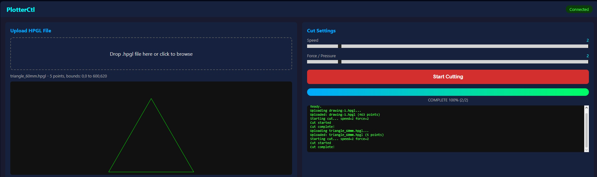
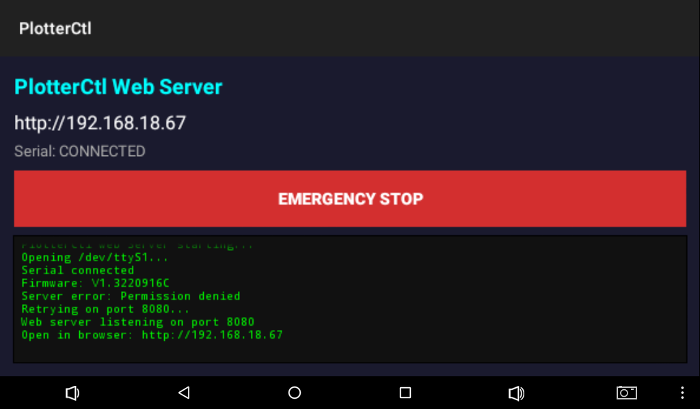

# OpenBladeRunner

Open-source web-based controller for **MyScreen CUT&USE Ploter PRO** cutting plotters. Replaces the proprietary app entirely — no cloud account, no POS registration, no licensing required.

Runs a web server directly on the plotter's Android board. Connect your plotter to WiFi, open the web UI from any device on your network, upload an HPGL file, and cut. That's it.


## Features

- **Web UI** — control the plotter from any browser on your network
- **HPGL file upload** with drag-and-drop
- **SVG path preview** before cutting
- **Adjustable parameters** — speed (1-10), force/pressure (1-10), paper feed distance
- **Real-time progress** tracking during cuts
- **Emergency stop** — both in web UI and a physical button on the plotter screen
- **Zero dependencies** — compiles with just the Android SDK command-line tools, no Gradle needed
- **Fully reverse-engineered protocol** — documented in [docs/PROTOCOL.md](docs/PROTOCOL.md)

## Screenshots

**Web UI** — upload HPGL files, preview paths, adjust settings, and cut from any browser:



**Device Screen** — shows server URL, serial connection status, and emergency stop button:



## Supported Hardware

| Device | Status |
|--------|--------|
| MyScreen CUT&USE Ploter PRO 11" v2 | Tested |
| Other MyScreen CUT&USE models | Should work (same protocol) |

The plotter runs Android 7.1 on a Rockchip RK3126C SoC with a separate MCU controlling the stepper motors via UART (`/dev/ttyS1` at 38400 baud).

## Quick Start

### Prerequisites

- **Android SDK** with build-tools (v35+) and platform (android-35+)
- **Java JDK 11+** (Android Studio's bundled JBR works)
- **ADB** (Android Debug Bridge) — included with Android SDK platform-tools
- The plotter connected via USB (ADB enabled by default)

The build scripts auto-detect SDK and JDK paths. If auto-detection fails, set these environment variables:
- `JAVA_HOME` — path to JDK (e.g., `C:\Program Files\Android\Android Studio\jbr`)
- `ANDROID_SDK_ROOT` — path to Android SDK (e.g., `C:\Android\android-sdk`)

### Build and Deploy (one command)

The easiest way — builds the APK and deploys to a connected plotter in one step:

**Windows (PowerShell):**
```powershell
powershell -ExecutionPolicy Bypass -File build-and-deploy.ps1
```

**Linux / macOS:**
```bash
./build-and-deploy.sh
```

The scripts will:
1. Auto-detect your Java and Android SDK installation
2. Build the APK (~33KB)
3. Find the connected plotter (skips emulators if any are running)
4. Install and launch the app

### Build Only

If you just want to build without deploying:

```bash
cd app
bash build.sh
```

This produces `app/build/plotterctl.apk`.

### Manual Deploy

If you prefer to deploy manually:

```bash
adb push app/build/plotterctl.apk /sdcard/plotterctl.apk
adb shell pm install -r /sdcard/plotterctl.apk
adb shell am force-stop com.plotter.pea.lamelplotterapp
adb shell am start -n com.cutter.plotterctl/.MainActivity
```

### Use

1. Connect the plotter to your WiFi network (via Android Settings)
2. The app shows the plotter's IP address on screen (e.g., `http://192.168.1.100`)
3. Open that URL with `:8080` in any browser (e.g., `http://192.168.1.100:8080`)
4. Upload an HPGL file, adjust speed/force/paper feed, and click **Start Cutting**

## HPGL File Format

The plotter accepts standard HPGL (HP Graphics Language) commands:

| Command | Description |
|---------|-------------|
| `IN;` | Initialize plotter |
| `PA;` | Plot Absolute mode |
| `VS<n>;` | Set speed (1-10) |
| `FS<n>;` | Set force/pressure (1-10) |
| `PU<x>,<y>;` | Pen Up — move without cutting |
| `PD<x>,<y>;` | Pen Down — move and cut |

Coordinates are in **0.025mm units** (40 units = 1mm, standard HP-GL 1016 DPI). For example, 2000 = 50mm, 4000 = 100mm.

### Sample Files

The `samples/` directory contains test files:

| File | Shape | Size |
|------|-------|------|
| `square_50mm.hpgl` | Square | 50 x 50mm |
| `circle_40mm.hpgl` | Circle | 40mm diameter |
| `triangle_60mm.hpgl` | Triangle | 60 x 52mm |
| `star_5point.hpgl` | 5-point star | 51 x 48mm |

### Generating HPGL Files

You can create HPGL files from SVG using tools like:
- [Inkscape](https://inkscape.org/) — File > Save As > HP Graphics Language (*.hpgl)
- [vpype](https://github.com/abey79/vpype) — `vpype read input.svg write output.hpgl`
- Any CAD/vector software with HPGL export

## Architecture

```
OpenBladeRunner
├── build-and-deploy.ps1                  # Build + deploy script (Windows PowerShell)
├── build-and-deploy.sh                   # Build + deploy script (Linux / macOS)
├── app/
│   ├── AndroidManifest.xml
│   ├── build.sh                          # Build-only script (bash)
│   ├── libs/armeabi-v7a/
│   │   └── libserial_port.so             # Native JNI serial port library (android-serialport-api)
│   ├── res/
│   │   ├── layout/activity_main.xml      # Android UI (status + stop button)
│   │   └── values/strings.xml
│   └── src/
│       ├── android_serialport_api/
│       │   └── SerialPort.java           # JNI wrapper for native serial
│       └── com/cutter/plotterctl/
│           ├── MainActivity.java         # Auto-connect + start web server
│           ├── PlotterProtocol.java      # Serial protocol + SHA-256 checksum
│           ├── WebServer.java            # HTTP server (ServerSocket-based)
│           ├── WebUI.java                # Embedded HTML/CSS/JS single-page app
│           ├── HpglParser.java           # HPGL parsing, preview, rewriting
│           └── CutJob.java               # Job state + progress tracking
├── samples/                              # Sample HPGL files for testing
├── docs/
│   └── PROTOCOL.md                       # Full protocol documentation
└── README.md
```

### How It Works

1. **MainActivity** opens `/dev/ttyS1` at 38400 baud using the native JNI serial library
2. **WebServer** starts an HTTP server on port 8080 (port 80 requires root)
3. User opens the web UI in a browser and uploads an HPGL file
4. **HpglParser** validates the file and extracts paths for SVG preview
5. When the user clicks "Start Cutting":
   - Speed/force parameters are injected into the HPGL data
   - A paper feed `PU` command is prepended
   - Data is sent to the MCU via the [cut protocol](docs/PROTOCOL.md#cut-data-protocol-sending-cut-jobs):
     - Header packet (CC 0130) with SHA-256 checksum
     - Chunked data packets (CC xx30) with simple byte-sum checksums
6. **CutJob** tracks progress through states: FEEDING → CUTTING → SENT → COMPLETE

### Serial Protocol

The plotter uses a custom binary protocol over UART with **SHA-256 based packet authentication**. The MCU silently rejects packets with incorrect checksums.

Key discovery: the checksum is computed by hashing the command bytes concatenated with a secret key (`hsznqmji`), then folding the 32-byte SHA-256 hash into 2 checksum bytes.

Full protocol documentation: [docs/PROTOCOL.md](docs/PROTOCOL.md)

## API Endpoints

The web server exposes these endpoints:

| Method | Path | Description |
|--------|------|-------------|
| `GET` | `/` | Web UI |
| `POST` | `/api/upload` | Upload HPGL file (multipart/form-data) |
| `GET` | `/api/preview` | Get parsed path data (JSON) |
| `POST` | `/api/cut` | Start cutting `{"speed":N,"force":N,"feed":N}` |
| `POST` | `/api/stop` | Emergency stop |
| `GET` | `/api/status` | Job state and progress (JSON) |

## Build Configuration

The build uses only Android SDK command-line tools:

| Tool | Purpose |
|------|---------|
| `aapt2` | Resource compilation and linking |
| `javac` | Java compilation (source level 11) |
| `d8` | DEX conversion |
| `zipalign` | APK alignment |
| `apksigner` | APK signing |

No Gradle, no Maven, no external dependencies. The entire app is ~33KB.

## Contributing

Contributions welcome! Areas that could use help:

- **SVG to HPGL converter** — eliminate the need for external conversion tools
- **Coordinate system calibration** — the X/Y axis mapping needs verification
- **More plotter models** — test with other MyScreen or compatible plotters
- **Material presets** — predefined speed/force settings for common materials (vinyl, paper, cardstock)

## Legal Notice

This project was developed through reverse engineering for **interoperability purposes**, as permitted under [EU Directive 2009/24/EC, Article 6](https://eur-lex.europa.eu/legal-content/EN/TXT/?uri=celex%3A32009L0024). No original source code from the manufacturer's application was copied or redistributed. The implementation is a clean-room rewrite based on observed protocol behavior.

## Disclaimer

This project is not affiliated with MyScreen or any plotter manufacturer. Use at your own risk. Always supervise the plotter during operation and use the emergency stop if anything goes wrong.

## License

[MIT](LICENSE)
